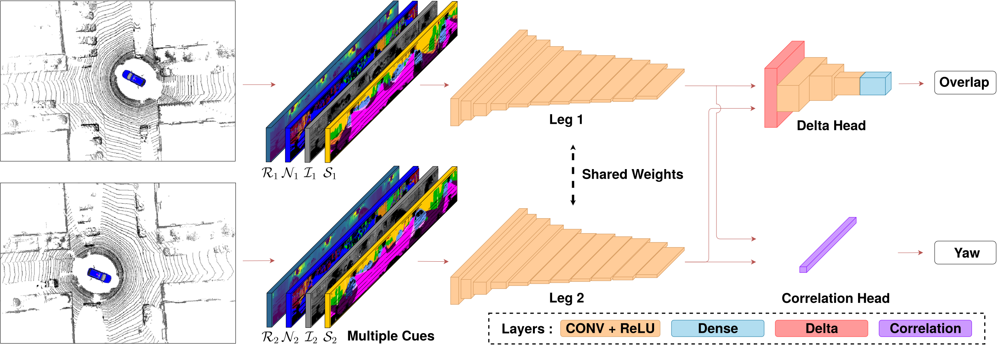
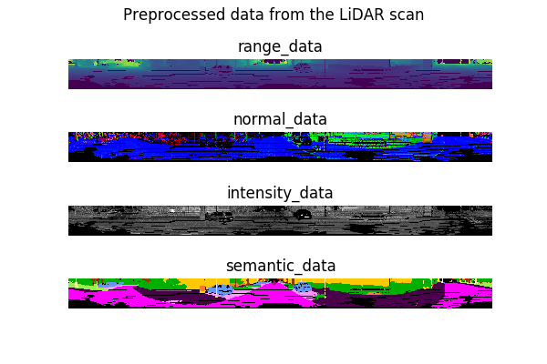
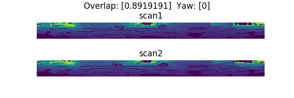
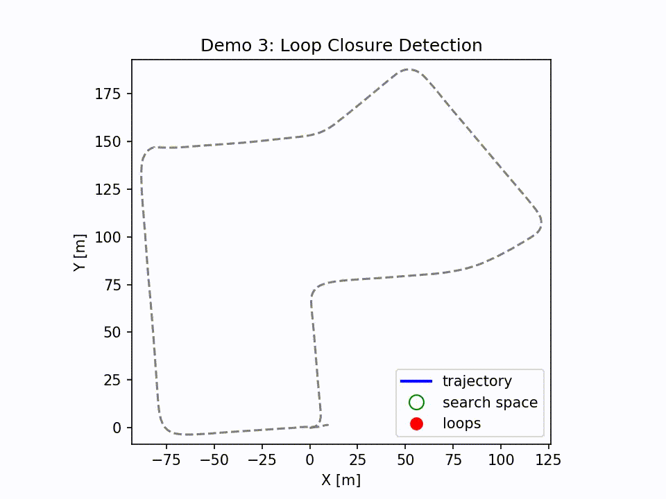
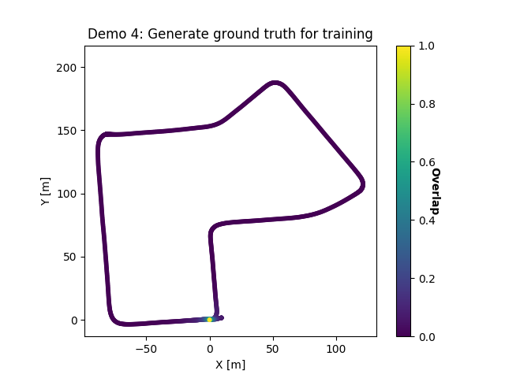

# OverlapNet - Loop Closing for 3D LiDAR-based SLAM

### OverlapNet was nominated as the Best System Paper at Robotics: Science and Systems (RSS) 2020 

This repo contains the code for our RSS2020 paper, OverlapNet.
 
OverlapNet is modified Siamese Network that predicts the overlap and relative yaw angle of a pair of range images generated by 3D LiDAR scans. 

Developed by [Xieyuanli Chen](http://www.ipb.uni-bonn.de/people/xieyuanli-chen/) and [Thomas Läbe](https://www.ipb.uni-bonn.de/people/thomas-laebe/).




Pipeline overview of OverlapNet.


### Table of Contents
0. [Introduction](#OverlapNet-was-nominated-as-the-Best-System-Paper-at-Robotics:-Science-and-Systems-(RSS)-2020)
0. [Publication](#Publication)
0. [Logs](#Logs)
0. [Dependencies](#Dependencies)
0. [How to use](#How-to-use)
0. [Application](#Application)
0. [License](#License)


## Publication
If you use our implementation in your academic work, please cite the corresponding [paper](https://www.ipb.uni-bonn.de/wp-content/papercite-data/pdf/chen2020rss.pdf):  
    
	@inproceedings{chen2020rss, 
			author = {X. Chen and T. L\"abe and A. Milioto and T. R\"ohling and O. Vysotska and A. Haag and J. Behley and C. Stachniss},
			title  = {{OverlapNet: Loop Closing for LiDAR-based SLAM}},
			booktitle = {Proceedings of Robotics: Science and Systems (RSS)},
			year = {2020},
			codeurl = {https://github.com/PRBonn/OverlapNet/},
			videourl = {https://www.youtube.com/watch?v=YTfliBco6aw},
	}

## Logs
### Version 1.1
- Added a method to the Infer class for inference with multiple frames versus multiple frames.
- Updated TensorFlow version in dependencies.
- Fixed bugs in generating ground truth overlap and yaw.
- Added an application and a link to our overlap-based MCL implementation. 
### Version 1.0
Open source initial submission

## Dependencies

We are using standalone keras with a tensorflow backend as a library for neural networks.

In order to do training and testing on a whole dataset, you need a nvidia GPU.
The demos still are fast enough when using the neural network on CPU.

To use a GPU, first you need to install the nvidia driver and CUDA, so have fun!

- CUDA Installation guide: [link](https://docs.nvidia.com/cuda/cuda-installation-guide-linux/index.html)

- System dependencies:

  ```bash
  sudo apt-get update 
  sudo apt-get install -y python3-pip python3-tk
  sudo -H pip3 install --upgrade pip
  ```

- Python dependencies (may also work with different versions than mentioned in the requirements file)

  ```bash
  sudo -H pip3 install -r requirements.txt
  ```


## How to use

This repository contains the neural network for doing a detection of loop closing candidates.

For a complete pipline for online LiDAR preprocessing, one could find the fast implementation in our [SuMa++](https://github.com/PRBonn/semantic_suma).

In this repository, we provide demos to show the functionaly. Additional to that, we explain
how to train a model.

### Demos

##### Demo 1: generate different types of data from the LiDAR scan
To try demo 1, you could directly run the script with one command line:

```bash
python3 demo/demo1_gen_data.py
```

The generated data are stored in `/data/preprocess_data`, and you will get a visualization like this:



##### Demo 2: Inferring overlap and relative yaw angle between two LiDAR scans
To run demo 2, you need to first download the pre-trained [model](http://www.ipb.uni-bonn.de/html/projects/overlap_net/model_geo.weight).

Then, you should
- either copy it into the default location folder `data` or
- you need to modify the `pretrained_weightsfilename` in the config file `/config/network.yml` accordingly.

Run the second demo script with one command line:

```bash
python3 demo/demo2_infer.py
```
You will get a visualization like this: 



##### Demo 3: Loop closure detection
To run demo 3, you need to first download several data:
- pre-trained [model](http://www.ipb.uni-bonn.de/html/projects/overlap_net/model_geo.weight), 
- KITTI odometry [data](http://www.ipb.uni-bonn.de/html/projects/overlap_net/kitti_07.zip), where we also provide the covariance information generated from the SLAM, 
- pre-processed [data](http://www.ipb.uni-bonn.de/html/projects/overlap_net/preprocess_07.zip).

If you follow the recommended [data structure](#data-structure) below, you extract the downloaded data into the folder `data`.

Otherwise, you need to specify the paths of data in both `config/network.yml` and `config/demo.yml` accordingly,

and then run the third demo script with one command line:

```bash
python3 demo/demo3_lcd.py
```

You will get an animation like this:




##### Demo 4: Generate ground truth overlap and yaw for training and testing
To run demo 4, you need only the raw KITTI odometry data. We are using the same
setup as in demo 3. 

Run the fourth demo script with one command line:

```bash
python3 demo/demo4_gen_gt_files.py
```

You will generated the ground truth data in `data/preprocess_data_demo/ground_truth` and get a plot like this:



The colors represent the ground truth overlap value of each frame with respect to the given current frame which is located at (0.0, 0.0).


### Train and test a model

For a quick test of the training and testing procedures, you could use our preprocessed data 
as used in [demo3](#demo-3-loop-closure-detection).

We only provide the geometric-based preprocessed data. But it will also be possible to generate other inputs
(semantics, intensity) by yourself. 

A simple example to generate different types of data from LiDAR scan is given in [demo1](#demos).

For 3D LiDAR semantic segmentation, we provide a fast c++ inferring library 
[rangenetlib](https://github.com/PRBonn/rangenet_lib).

#### Data structure

For training a new model with OverlapNet, you need to first generate preprocessed data and ground truth overlap and yaw angle which you could find examples in [demo1](#demos) and [demo4](#demo-4-generate-ground-truth-overlap-and-yaw-for-training-and-testing).

The recommended data structure is as follows:

```bash
data
    ├── 07
    │   ├── calib.txt
    │   ├── covariance.txt
    │   ├── poses.txt
    │   ├── depth
    │   │   ├── 000000.npy
    │   │   ├── 000001.npy
    │   │   └── ...
    │   ├── normal
    │   │   ├── 000000.npy
    │   │   ├── 000001.npy
    │   │   └── ...
    │   ├── velodyne
    │   │   ├── 000000.bin
    │   │   ├── 000001.bin
    │   │   └── ...
    │   └── ground_truth
    │       ├── ground_truth_overlap_yaw.npz
    │       ├── test_set.npz
    │       └── train_set.npz
    └── model_geo.weight
```


#### Training

The code for training can be found in `src/two_heads/training.py`. 

If you download our preprocessed data, please put the data into the folder `data`.
If you want to use another directory, please change the parameter `data_root_folder` in
the configuration file `network.yml`.

Notice that default weight file is set in the configuration file with 
parameter `pretrained_weightsfilename`.
If you want to train a completely new model from scratch, leave this parameter empty. 
Otherwise you will fine-tune the provided model.

Then you can start the training with

```
python3 src/two_heads/training.py config/network.yml
```

All configuration data is in the yml file. You will find path definitions and training parameters there. The
main path settings are:
- `experiments_path`: the folder where all the training data and results (log files, tensorboard logs, network weights)
  will be saved. Default is `/tmp`. Change this according to your needs
- `data_root_folder`: the dataset folder. Is should contain the sequence folders of the dataset e.g. as `00`, `01`, ..., For the provided preproecessed data, it should be `07`.

We provide tensorboard logs in `experiment_path/testname/tblog` for visualizing training and validation details.

#### Testing 

Once a model has been trained (thus a file `.weight` with the network weights is available), the performance of the network
can be evaluated. Therefore you can start the testing script in the same manner as the training with the testing script:

```
python3 src/two_heads/testing.py config/network.yml
```

The configuration file should have the following additional settings:
- `pretrained_weightsfilename`: the weight filename mentioned as parameter
- `testing_seqs`: sequences to test on, e.g. `00 01`. (Please comment out `training_seqs`.) The pairs where the tests are computed are in 
   the file `ground_truth/ground_truth_overlap_yaw.npz`. If one still uses the parameter `training_seqs`, the validation
   is done on the test sets of the sequences (`ground_truth/validation_set.npz`) which contain only a small amount of data used 
   for validation during training.

Note that: the provided pre-trained model and preprocessed ground truth are with the constraint that the current frame only finds loop closures in the previous frames.


## Application
### [Overlap-based Monte Carlo Localization](https://github.com/PRBonn/overlap_localization)
This repo contains the code for our IROS2020 paper: Learning an Overlap-based Observation Model for 3D LiDAR Localization.

It uses the OverlapNet to train an observation model for Monte Carlo Localization and achieves global localization with 3D LiDAR scans.


## License

Copyright 2020, Xieyuanli Chen, Thomas Läbe, Cyrill Stachniss, Photogrammetry and Robotics Lab, University of Bonn.

This project is free software made available under the MIT License. For details see the LICENSE file.


